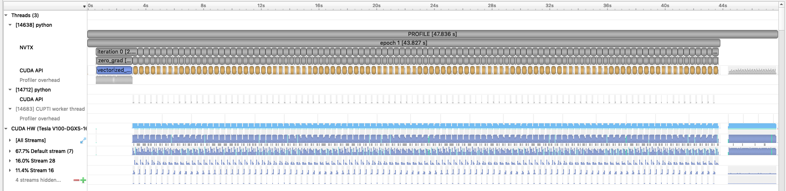
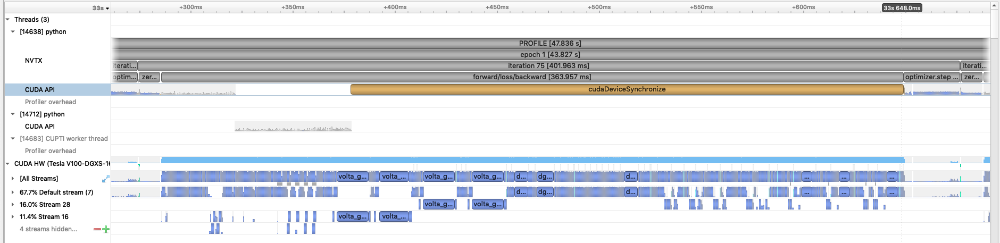
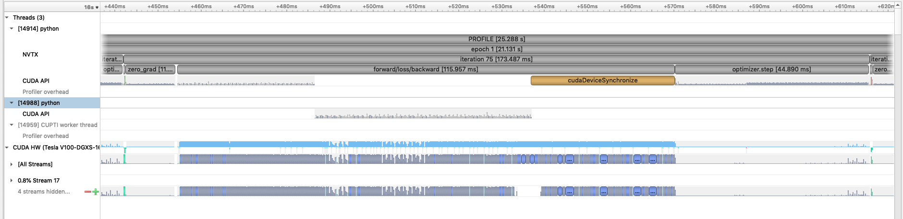
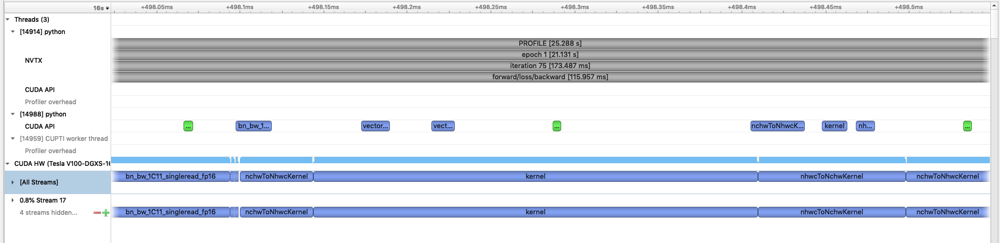
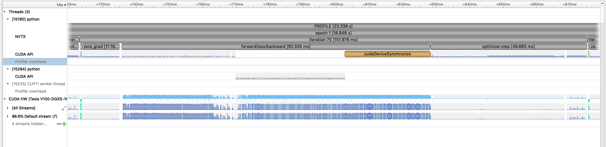
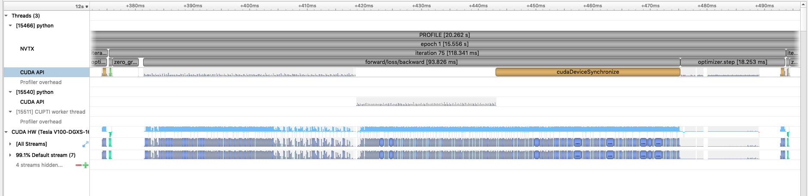
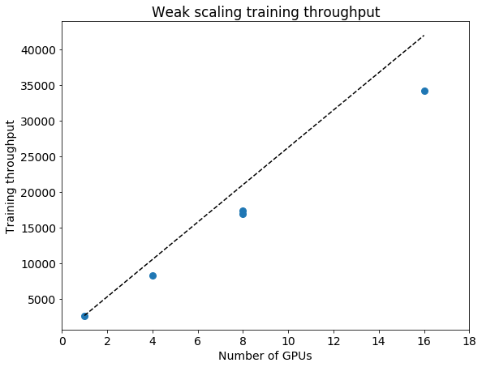

# SC20 Deep Learning at Scale Tutorial

This repository contains the example code material for the SC20 tutorial:
*Deep Learning at Scale*.

The example demonstrates *synchronous data-parallel distributed training* of a
convolutional deep neural network implemented in [PyTorch](https://pytorch.org/)
on a standard computer vision problem. In particular, we are training ResNet50
on the [CIFAR-100](https://www.cs.toronto.edu/~kriz/cifar.html) dataset to
classify images into 100 classes.

**Contents**
* [Links](#links)
* [Installation](#installation)
* [Model, data, and training code overview](#model-data-and-training-code-overview)
* [Single GPU training](#single-gpu-training)
* [Performance profiling and optimization](#performance-profiling-and-optimization)
    * [Profiling with Nsight Systems](#profiling-with-nsight-systems)
    * [Enabling Mixed Precision Training](#enabling-mixed-precision-training)
    * [Applying additional PyTorch optimizations](#applying-additional-pytorch-optimizations)
* [Distributed GPU training](#distributed-gpu-training)

## Links

Presentation slides for the tutorial can be found at:
https://drive.google.com/drive/folders/1-gi1WvfQ6alDOnMwN3JqgNlrQh7MlIQr?usp=sharing

## Installation

If you're running these examples on the Cori GPU system at NERSC, no
installation is needed; you can simply use our provided modules or
shifter containers.

See the [submit.slr](submit.slr) slurm script for a simple example using
an NVIDIA NGC PyTorch container.

## Model, data, and training code overview

The network architecture for our ResNet50 model can be found in
[models/resnet.py](models/resnet.py). Here we have copied the ResNet50
implementation from torchvision and made a few minor adjustments for the
CIFAR dataset (e.g. reducing stride and pooling).

The data pipeline code can be found in
[utils/cifar100\_data\_loader.py](utils/cifar100_data_loader.py).
Note that the dataset code for this example is fairly simple because the
torchvision package provides the dataset class which handles the image
loading for us. Key ingredients:
* We compose a sequence of data transforms for normalization and random
  augmentation of the images.
* We construct a `datasets.CIFAR100` dataset which will automatically download
  the dataset to a specified directory. We pass it our list of transforms.
* We construct a DataLoader which orchestrates the random sampling and batching
  of our images.

The basic training logic can be found in [train.py](train.py).
In this training script we have defined a simple Trainer class which
implements methods for training and validation epochs. Key ingredients:
* In the Trainer's `__init__` method, we get the data loaders, construct our
  ResNet50 model, the SGD optimizer, and our `CrossEntropyLoss` objective
  function.
* In the Trainer's `train_one_epoch` method, we implement the actual logic for
  training the model on batches of data.
    * Identify where we loop over data batches from our data loader.
    * Identify where we apply the forward pass of the model ("Model forward pass")
      and compute the loss function.
    * Identify where we call `backward()` on the loss value. Note the use of the
      `grad_scaler` will be explained below when enabling mixed precision.
* Similarly, in the Trainer's `validate_one_epoch`, we implement the simpler
  logic of applying the model to a validation dataset and compute metrics like
  accuracy.
* Checkpoint saving and loading are implemented in the Trainer's `save_checkpoint`
  and `restore_checkpoint` methods, respectively.
* We construct and use a TensorBoard SummaryWriter for logging metrics to
  visualize in TensorBoard. See if you can find where our specific metrics
  are logged via the `add_scalar` call.

## Single GPU training

To run single GPU training of the baseline training script, use the following command:
```
$ python train.py --config=bs128
```
This will run the training on a single GPU using batch size of 128
(see `config/cifar100.yaml` for specific configuration details).
Note we will use batch size 256 for the optimization work in the next section
and will push beyond to larger batch sizes in the distributed training section.

**Would be good to show a convergence result here, e.g. TB screenshot.**

## Performance profiling and optimization

This is the performance of the baseline script using the NGC PyTorch 20.10 container for the first two epochs on a 16GB V100 card with batch size 256:
```
INFO - Starting Training Loop...
INFO - Epoch: 1, Iteration: 0, Avg img/sec: 110.19908073510402
INFO - Epoch: 1, Iteration: 20, Avg img/sec: 680.8613838734273
INFO - Epoch: 1, Iteration: 40, Avg img/sec: 682.4229819820212
INFO - Epoch: 1, Iteration: 60, Avg img/sec: 683.0516710020236
INFO - Epoch: 1, Iteration: 80, Avg img/sec: 681.2955112832597
INFO - Epoch: 1, Iteration: 100, Avg img/sec: 681.7366420029032
INFO - Epoch: 1, Iteration: 120, Avg img/sec: 680.9312458089512
INFO - Epoch: 1, Iteration: 140, Avg img/sec: 680.2227561980723
INFO - Epoch: 1, Iteration: 160, Avg img/sec: 680.6287580660272
INFO - Epoch: 1, Iteration: 180, Avg img/sec: 680.7244649829499
INFO - Time taken for epoch 1 is 79.90803146362305 sec
INFO - Epoch: 2, Iteration: 0, Avg img/sec: 297.1326786725325
INFO - Epoch: 2, Iteration: 20, Avg img/sec: 680.1821654149742
INFO - Epoch: 2, Iteration: 40, Avg img/sec: 679.7391921357676
INFO - Epoch: 2, Iteration: 60, Avg img/sec: 680.29168975637
INFO - Epoch: 2, Iteration: 80, Avg img/sec: 680.2163354650426
INFO - Epoch: 2, Iteration: 100, Avg img/sec: 680.1871635938127
INFO - Epoch: 2, Iteration: 120, Avg img/sec: 679.7543395008651
INFO - Epoch: 2, Iteration: 140, Avg img/sec: 679.708426128615
INFO - Epoch: 2, Iteration: 160, Avg img/sec: 679.2982136487756
INFO - Epoch: 2, Iteration: 180, Avg img/sec: 679.0788730107779
INFO - Time taken for epoch 2 is 78.5151789188385 sec
```

### Profiling with Nsight Systems
Before generating a profile with Nsight, we can add NVTX ranges to the script to add context to the produced timeline. First, we can enable PyTorch's built-in NVTX annotations by using the `torch.autograd.profiler.emit_nvtx` context manager.
We can also manually add some manually defined NVTX ranges to the code using `torch.cuda.nvtx.range_push` and `torch.cuda.nvtx.range_pop`. Search `train.py` for comments labeled `# PROF` to see where we've added code.
As a quick note, we defined some simple functions to wrap the NVTX range calls in order to add synchronization:
```
def nvtx_range_push(name, enabled):
  if enabled:
    torch.cuda.synchronize()
    torch.cuda.nvtx.range_push(name)

def nvtx_range_pop(enabled):
  if enabled:
    torch.cuda.synchronize()
    torch.cuda.nvtx.range_pop()
```
As GPU operations can be asynchronous with respect to the Python thread, these syncs are necessary to create accurate ranges. Without them, the ranges will only contain the time to _launch_ the GPU work.


To generate a timeline, run the following:
```
$ NSYS_NVTX_PROFILER_REGISTER_ONLY=0 nsys profile -o baseline --trace=cuda,nvtx --capture-range=nvtx --nvtx-capture=PROFILE python -m torch.distributed.launch --nproc_per_node=1 train.py --config=bs256-prof
```
This command will run two shortened epochs of 80 iterations of the training script and produce a file `baseline.qdrep` that can be opened in the Nsight System's program. The arg `--trace=cuda,nvtx` is optional and is used here to disable OS Runtime tracing for speed.
The args `--capture-range=nvtx --nvtx-capture=PROFILE` and variable `NSYS_NVTX_PROFILER_REGISTER_ONLY=0` will limit the profiling to the NVTX range named "PROFILE", which we've used to limit profiling to the second epoch only.

Loading this profile in Nsight Systems will look like this:


With our NVTX ranges, we can easily zoom into a single iteration and get an idea of where compute time is being spent:



### Enabling Mixed Precision Training
As a first step to improve the compute performance of this training script, we can enable automatic mixed precision (AMP) in PyTorch. AMP provides a simple way for users to convert existing FP32 training scripts to mixed FP32/FP16 precision, unlocking
faster computation with Tensor Cores on NVIDIA GPUs. The AMP module in torch is composed of two main parts: `torch.cuda.amp.GradScaler` and `torch.cuda.amp.autocast`. `torch.cuda.amp.GradScaler` handles automatic loss scaling to control the range of FP16 gradients.
The `torch.cuda.amp.autocast` context manager handles converting model operations to FP16 where appropriate. Search `train.py` for comments labeled `# AMP:` to see where we've added code to enable AMP in this script.

To run the script on a single GPU with AMP enabled, use the following command:
```
$ python -m torch.distributed.launch --nproc_per_node=1 train.py --config=bs256-amp
```
With AMP enabled, this is the performance of the baseline using the NGC PyTorch 20.10 container for the first two epochs on a 16GB V100 card:
```
INFO - Starting Training Loop...
INFO - Epoch: 1, Iteration: 0, Avg img/sec: 131.4890829860097
INFO - Epoch: 1, Iteration: 20, Avg img/sec: 1925.8088037080554
INFO - Epoch: 1, Iteration: 40, Avg img/sec: 1884.341731901802
INFO - Epoch: 1, Iteration: 60, Avg img/sec: 1796.3608488557659
INFO - Epoch: 1, Iteration: 80, Avg img/sec: 1797.1991164491794
INFO - Epoch: 1, Iteration: 100, Avg img/sec: 1794.721454602102
INFO - Epoch: 1, Iteration: 120, Avg img/sec: 1800.0616660977953
INFO - Epoch: 1, Iteration: 140, Avg img/sec: 1794.3491050370249
INFO - Epoch: 1, Iteration: 160, Avg img/sec: 1797.8587343614402
INFO - Epoch: 1, Iteration: 180, Avg img/sec: 1794.0956118635277
INFO - Time taken for epoch 1 is 33.888301610946655 sec
INFO - Epoch: 2, Iteration: 0, Avg img/sec: 397.0763949367613
INFO - Epoch: 2, Iteration: 20, Avg img/sec: 1831.3360728112361
INFO - Epoch: 2, Iteration: 40, Avg img/sec: 1804.6830246566537
INFO - Epoch: 2, Iteration: 60, Avg img/sec: 1799.7809136620713
INFO - Epoch: 2, Iteration: 80, Avg img/sec: 1793.427968035233
INFO - Epoch: 2, Iteration: 100, Avg img/sec: 1794.953670200433
INFO - Epoch: 2, Iteration: 120, Avg img/sec: 1795.3373776036665
INFO - Epoch: 2, Iteration: 140, Avg img/sec: 1791.194021111478
INFO - Epoch: 2, Iteration: 160, Avg img/sec: 1825.7166134675574
INFO - Epoch: 2, Iteration: 180, Avg img/sec: 1794.5686271249087
INFO - Time taken for epoch 2 is 33.07876420021057 sec
```

You can run another profile (using `--config=bs256-amp-prof`) with Nsight Systems. Loading this profile and zooming into a single iteration, this is what we see:


With AMP enabled, we see that the `forward/loss/backward` time is significatly reduced. As this is a CNN, the forward and backward convolution ops are well-suited to benefit from acceleration with tensor cores.

If we zoom into the forward section of the profile to the GPU kernels, we can see very many calls to `nchwToNhwc` and `nhwcToNCHW` kernels:


These kernels are transposing the data from PyTorch's native data layout (NCHW or channels first) to the NHWC (or channels last) format which cuDNN requires to use tensor cores. Luckily, there is a way to avoid these transposes by using the `torch.channels_last` memory
format. To use this, we need to convert both the model and the input image tensors to this format by using the following lines:
```
model = model.to(memory_format=torch.channels_last)
images = images.to(memory_format=torch.channels_last)
```
Search `train.py` for comments labeled  `# NHWC` to see where we've added these lines to run the model using NHWC format.

To run the script on a single GPU with AMP enabled using the NHWC memory format, use the following command:
```
$ python -m torch.distributed.launch --nproc_per_node=1 train.py --config=bs256-amp-nhwc
```
With AMP enabled using the NHWC memory format, this is the performance of the script using the NGC PyTorch 20.10 container for the first two epochs on a 16GB V100 card:
```
INFO - Starting Training Loop...
INFO - Epoch: 1, Iteration: 0, Avg img/sec: 125.35020387731124
INFO - Epoch: 1, Iteration: 20, Avg img/sec: 2089.3251919566933
INFO - Epoch: 1, Iteration: 40, Avg img/sec: 2075.2397782670346
INFO - Epoch: 1, Iteration: 60, Avg img/sec: 2078.1579609491064
INFO - Epoch: 1, Iteration: 80, Avg img/sec: 2114.314909986603
INFO - Epoch: 1, Iteration: 100, Avg img/sec: 2076.3754707171784
INFO - Epoch: 1, Iteration: 120, Avg img/sec: 2066.673609844659
INFO - Epoch: 1, Iteration: 140, Avg img/sec: 2070.3321011509784
INFO - Epoch: 1, Iteration: 160, Avg img/sec: 2107.977617868012
INFO - Epoch: 1, Iteration: 180, Avg img/sec: 2117.288989717637
INFO - Time taken for epoch 1 is 30.756738424301147 sec
INFO - Epoch: 2, Iteration: 0, Avg img/sec: 464.2617647745541
INFO - Epoch: 2, Iteration: 20, Avg img/sec: 2151.947432559358
INFO - Epoch: 2, Iteration: 40, Avg img/sec: 2208.417190923362
INFO - Epoch: 2, Iteration: 60, Avg img/sec: 2177.7232959147427
INFO - Epoch: 2, Iteration: 80, Avg img/sec: 2226.609558578422
INFO - Epoch: 2, Iteration: 100, Avg img/sec: 2253.0767957237485
INFO - Epoch: 2, Iteration: 120, Avg img/sec: 2137.2692109868517
INFO - Epoch: 2, Iteration: 140, Avg img/sec: 2214.0994804791235
INFO - Epoch: 2, Iteration: 160, Avg img/sec: 2195.9345278285564
INFO - Epoch: 2, Iteration: 180, Avg img/sec: 2162.628100059094
INFO - Time taken for epoch 2 is 28.39500093460083 sec
```
With the NCHW/NHWC tranposes removed, we see another modest gain in throughput. You can run another profile (using `--config=bs256-amp-nhwc-prof`) with Nsight Systems. Loading this profile and zooming into a single iteration, this is what we see now:


Using the NHWC memory format with AMP, we see that the `forward/loss/backward` times are reduced further due to no longer calling the transpose kernels. Now we can move onto some other small PyTorch-specific optimizations to deal with the remaining sections that stand out in the profile.

### Applying additional PyTorch optimizations
With the forward and backward pass accelerated with AMP and NHWC memory layout, the remaining NVTX ranges we added to the profile stand out, namely the `zero_grad` marker and `optimizer.step`.

To speed up the `zero_grad`, we can add the following argument to the `zero_grad` call:
```
self.model.zero_grad(set_to_none=True)
```
This optional argument allows PyTorch to skip memset operations to zero out gradients and also allows PyTorch to set gradients with a single write (`=` operator) instead of a read/write (`+=` operator).


If we look closely at the `optimizer.step` range in the profile, we see that there are many indivdual pointwise operation kernels launched. To make this more efficient, we can replace the native PyTorch SGD optimizer with the `FusedSGD` optimizer from the `Apex` package, which fuses many of these pointwise
operations.

Finally, as a general optimization, we add the line `torch.backends.cudnn.benchmark = True` to the start of training to enable cuDNN autotuning. This will allow cuDNN to test and select algorithms that run fastest on your system/model.

Search `train.py` for comments labeled `# EXTRA` to see where we've added changes for these additional optimizations.


To run the script on a single GPU with AMP enabled, NHWC memory format and these additional optimizations, use the following command:
```
$ python -m torch.distributed.launch --nproc_per_node=1 train.py --config=bs256-amp-nhwc-extra-opts
```
With all these features enabled, this is the performance of the script using the NGC PyTorch 20.10 container for the first two epochs on a 16GB V100 card:
```
INFO - Starting Training Loop...
INFO - Epoch: 1, Iteration: 0, Avg img/sec: 51.52879474970972
INFO - Epoch: 1, Iteration: 20, Avg img/sec: 2428.815812361664
INFO - Epoch: 1, Iteration: 40, Avg img/sec: 2471.928460752096
INFO - Epoch: 1, Iteration: 60, Avg img/sec: 2461.6635515925623
INFO - Epoch: 1, Iteration: 80, Avg img/sec: 2461.5230335547976
INFO - Epoch: 1, Iteration: 100, Avg img/sec: 2470.371590429863
INFO - Epoch: 1, Iteration: 120, Avg img/sec: 2462.8998420750218
INFO - Epoch: 1, Iteration: 140, Avg img/sec: 2567.007655538539
INFO - Epoch: 1, Iteration: 160, Avg img/sec: 2531.0173058079126
INFO - Epoch: 1, Iteration: 180, Avg img/sec: 2577.144387068793
INFO - Time taken for epoch 1 is 30.52899408340454 sec
INFO - Epoch: 2, Iteration: 0, Avg img/sec: 410.57308753695185
INFO - Epoch: 2, Iteration: 20, Avg img/sec: 2547.8182536936824
INFO - Epoch: 2, Iteration: 40, Avg img/sec: 2519.104752035505
INFO - Epoch: 2, Iteration: 60, Avg img/sec: 2529.822264348943
INFO - Epoch: 2, Iteration: 80, Avg img/sec: 2539.450348785371
INFO - Epoch: 2, Iteration: 100, Avg img/sec: 2533.167522740291
INFO - Epoch: 2, Iteration: 120, Avg img/sec: 2542.63597641221
INFO - Epoch: 2, Iteration: 140, Avg img/sec: 2502.990963521907
INFO - Epoch: 2, Iteration: 160, Avg img/sec: 2525.3185224087124
INFO - Epoch: 2, Iteration: 180, Avg img/sec: 2501.353650885946
INFO - Time taken for epoch 2 is 25.808385372161865 sec
```

We can run a final profile with all the optimizations enabled (using `--config=bs256-amp-nhwc-extra-opts-prof`) with Nsight Systems. Loading this profile and zooming into a single iteration, this is what we see now:

With these additional optimizations enabled in PyTorch, we see the length of the `zero_grad` and `optimizer.step` ranges are greatly reduced, as well as a small improvement in the `forward/loss/backward` time.

## Distributed GPU training

Now that we have model training code that is optimized for training on a single GPU,
we are ready to utilize multiple GPUs and multiple nodes to accelerate the workflow
with *distributed training*. We will use the recommended `DistributedDataParallel`
wrapper in PyTorch with the NCCL backend for optimized communication operations on
systems with NVIDIA GPUs. Refer to the PyTorch documentation for additional details
on the distributed package: https://pytorch.org/docs/stable/distributed.html

We use the `torch.distributed.launch` utility for launching training processes
on one node, one per GPU. The [submit\_multinode.slr](submit_multinode.slr)
script shows how we use the utility with SLURM to launch the tasks on each node
in our system allocation.

In the [train.py](train.py) script, near the bottom in the main script execution,
we set up the distributed backend. We use the environment variable initialization
method, automatically configured for us when we use the `torch.distributed.launch` utility.

In the `get_data_loader` function in
[utils/cifar100\_data\_loader.py](utils/cifar100_data_loader.py), we use the
DistributedSampler from PyTorch which takes care of partitioning the dataset
so that each training process sees a unique subset.

In our Trainer's `__init__` method, after our ResNet50 model is constructed,
we convert it to a distributed data parallel model by wrapping it as:

    self.model = DistributedDataParallel(self.model, ...)

The DistributedDataParallel (DDP) model wrapper takes care of broadcasting
initial model weights to all workers and performing all-reduce on the gradients
in the training backward pass to properly synchronize and update the model
weights in the distributed setting.

**Point out our implementation of convergence tricks**

**Discuss results, overall speedup**


